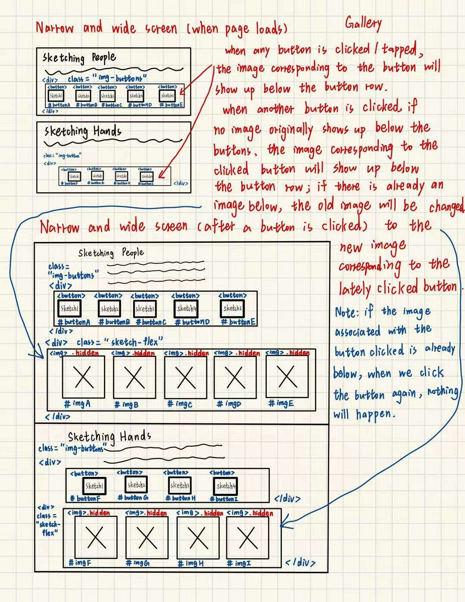
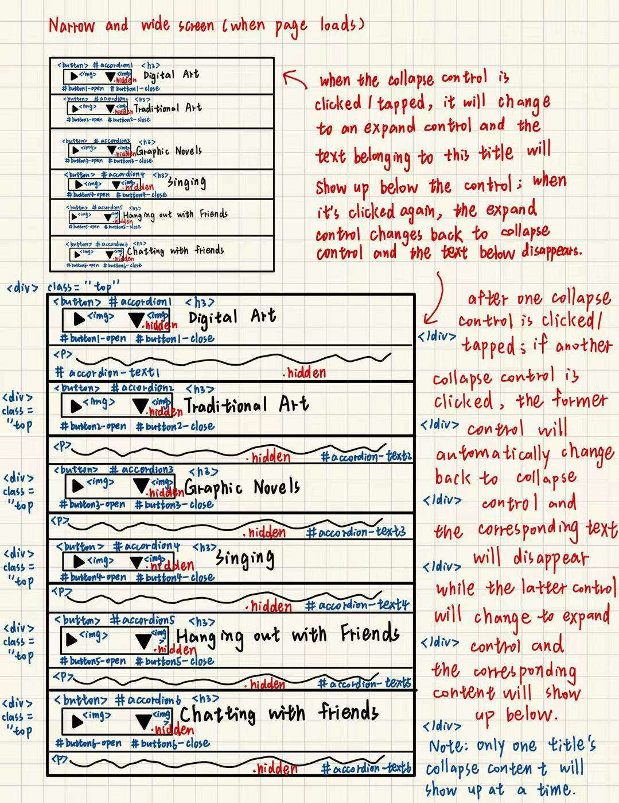
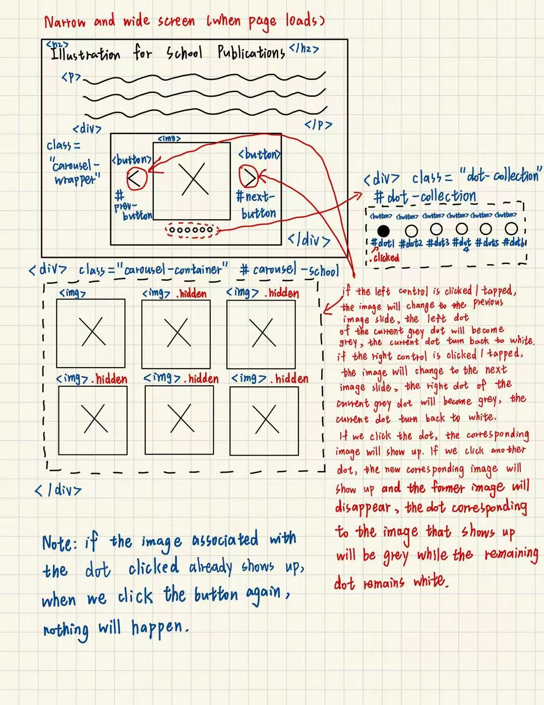

# Group Project, Final Milestone: Design Journey - Spring 2025

## Milestone 2 Feedback Revisions
> Explain what you revised in response to the Milestone 2 feedback (1-2 sentences)<br>
> If you didn't make any revisions, explain why.

We did not make any revisions as we did not get any negative feedback. We did, however, come up with new interactivity ideas that we had not included in our idea section in milestone 2 (i.e. the accordion in the index.html page).


## Interactivity Plan
> List the types of interactivity you plan to include in your project.<br>
> Provide a brief summary (a few words) for each type of interactivity you plan to implement.

- Image galleries in the Artistic Process page to make it easier to see the images when there are 4-5 images in a row.
- Image section toggle button (show/hide images) in each section of the Artwork page to improve visibility and customization.
- 2 modals on the Influences page that will make the two images there pop up so they can be seen better.
- An accordion in the Interest section of the home page to allow audience to click/tap to learn more about Ivy's interest.
- An image carousel in the Illustration for School Publications section of the Artwork page to display several Ivy's artworks at a time.


## Interactivity Design Sketches
> Create design sketch(es) to plan your interactivity's design.<br>
> **Sketch out where your interactivity will go on the page itself.**<br>
> For example, do not just sketch a carousel; instead, sketch the carousel on the page where it will appear.<br>
> Add annotations to explain what happens when the user takes an action. (This is not pseudocode.)<br>
> Include as many sketches as necessary to communicate your design (ask yourself, could another 1300 take these sketches an implement my design?)

Design sketch for gallery


Design sketch for accordion


Design sketch for carousel


## Interactivity Planning Sketches
> Produce planning sketches that include all the details another 1300 student would need to implement your design.<br>
> Your planning sketches should include _all_ HTML elements needed for the interactivity; _annotations_ for the element types, their unique IDs, and CSS classes; and lastly the initial CSS classes.

Planning sketch for gallery


Planning sketch for accordion


Planning sketch for carousel



## Interactivity Pseudocode Plan
> Write your interactivity pseudocode plan here.<br>
> Pseudocode is not JavaScript. Do not put JavaScript nor snippets code here.

```
> Pseudocode for image gallery for Sketching People section of Artistic Process page:

when <button> #buttonA is clicked (event):
  remove .hidden from <div> #imgA
  add .hidden to <div> #imgB
  add .hidden to <div> #imgC
  add .hidden to <div> #imgD
  add .hidden to <div> #imgE

when <button> #buttonB is clicked (event):
  remove .hidden from <div> #imgB
  add .hidden to <div> #imgA
  add .hidden to <div> #imgC
  add .hidden to <div> #imgD
  add .hidden to <div> #imgE

when <button> #buttonC is clicked (event):
  remove .hidden from <div> #imgC
  add .hidden to <div> #imgA
  add .hidden to <div> #imgB
  add .hidden to <div> #imgD
  add .hidden to <div> #imgE

when <button> #buttonD is clicked (event):
  remove .hidden from <div> #imgD
  add .hidden to <div> #imgA
  add .hidden to <div> #imgB
  add .hidden to <div> #imgC
  add .hidden to <div> #imgE

when <button> #buttonE is clicked (event):
  remove .hidden from <div> #imgE
  add .hidden to <div> #imgA
  add .hidden to <div> #imgB
  add .hidden to <div> #imgC
  add .hidden to <div> #imgD

> Pseudocode for show/hide image button at the bottom of every section in the Artwork page:

when <button> #buttonA is clicked (event):
  if <div> #sectionA has class .hidden:
    remove .hidden from <div> #sectionA
  else:
    add .hidden to <div> #sectionA

when <button> #buttonB is clicked (event):
  if <div> #sectionB has class .hidden:
    remove .hidden from <div> #sectionB
  else:
    add .hidden to <div> #sectionB

when <button> #buttonC is clicked (event):
  if <div> #sectionC has class .hidden:
    remove .hidden from <div> #sectionC
  else:
    add .hidden to <div> #sectionC

when <button> #buttonD is clicked (event):
  if <div> #sectionD has class .hidden:
    remove .hidden from <div> #sectionD
  else:
    add .hidden to <div> #sectionD

when <button> #buttonE is clicked (event):
  if <div> #sectionE has class .hidden:
    remove .hidden from <div> #sectionE
  else:
    add .hidden to <div> #sectionE

when <button> #buttonF is clicked (event):
  if <div> #sectionF has class .hidden:
    remove .hidden from <div> #sectionF
  else:
    add .hidden to <div> #sectionF

when <button> #buttonG is clicked (event):
  if <div> #sectionG has class .hidden:
    remove .hidden from <div> #sectionG
  else:
    add .hidden to <div> #sectionG

> Pseudocode for image gallery for Sketching Hands section of Artistic Process page:

when <button> #buttonF is clicked (event):
  remove .hidden from <div> #imgF
  add .hidden to <div> #imgG
  add .hidden to <div> #imgH
  add .hidden to <div> #imgI

when <button> #buttonG is clicked (event):
  remove .hidden from <div> #imgG
  add .hidden to <div> #imgF
  add .hidden to <div> #imgH
  add .hidden to <div> #imgI

when <button> #buttonH is clicked (event):
  remove .hidden from <div> #imgH
  add .hidden to <div> #imgF
  add .hidden to <div> #imgG
  add .hidden to <div> #imgI

when <button> #buttonI is clicked (event):
  remove .hidden from <div> #imgI
  add .hidden to <div> #imgF
  add .hidden to <div> #imgG
  add .hidden to <div> #imgH

> Pseudocode for accordion for Interests section of Home page:

when <button> #accordion1 is clicked (event):
    if #button1-open has class .hidden:
        remove .hidden from #button1-open
        add .hidden to #button1-close, #accordion-text1
    else:
        add .hidden to #button1-open
        remove .hidden to #button1-close, #accordion-text1
        remove .hidden from #button2-open, #button3-open, #button4-open, #button5-open, #button6-open
        add .hidden to #button2-close, #button3-close, #button4-close, #button5-close, #button6-close
        add .hidden to #accordion-text2, #accordion-text3, #accordion-text4, #accordion-text5, #accordion-text6

when <button> #accordion2 is clicked (event):
    if #button2-open has class .hidden:
        remove .hidden from #button2-open
        add .hidden to #button2-close, #accordion-text2
    else:
        add .hidden to #button2-open
        remove .hidden to #button2-close, #accordion-text2
        remove .hidden from #button1-open, #button3-open, #button4-open, #button5-open, #button6-open
        add .hidden to #button1-close, #button3-close, #button4-close, #button5-close, #button6-close
        add .hidden to #accordion-text1, #accordion-text3, #accordion-text4, #accordion-text5, #accordion-text6

when <button> #accordion3 is clicked (event):
    if #button3-open has class .hidden:
        remove .hidden from #button3-open
        add .hidden to #button3-close, #accordion-text3
    else:
        add .hidden to #button3-open
        remove .hidden to #button3-close, #accordion-text3
        remove .hidden from #button2-open, #button1-open, #button4-open, #button5-open, #button6-open
        add .hidden to #button2-close, #button1-close, #button4-close, #button5-close, #button6-close
        add .hidden to #accordion-text2, #accordion-text1, #accordion-text4, #accordion-text5, #accordion-text6

when <button> #accordion4 is clicked (event):
    if #button4-open has class .hidden:
        remove .hidden from #button4-open
        add .hidden to #button4-close, #accordion-text4
    else:
        add .hidden to #button4-open
        remove .hidden to #button4-close, #accordion-text4
        remove .hidden from #button2-open, #button3-open, #button1-open, #button5-open, #button6-open
        add .hidden to #button2-close, #button3-close, #button1-close, #button5-close, #button6-close
        add .hidden to #accordion-text2, #accordion-text3, #accordion-text1, #accordion-text5, #accordion-text6

when <button> #accordion5 is clicked (event):
    if #button5-open has class .hidden:
        remove .hidden from #button5-open
        add .hidden to #button5-close, #accordion-text5
    else:
        add .hidden to #button5-open
        remove .hidden to #button5-close, #accordion-text5
        remove .hidden from #button2-open, #button3-open, #button4-open, #button1-open, #button6-open
        add .hidden to #button2-close, #button3-close, #button4-close, #button1-close, #button6-close
        add .hidden to #accordion-text2, #accordion-text3, #accordion-text4, #accordion-text1, #accordion-text6

when <button> #accordion6 is clicked (event):
    if #button6-open has class .hidden:
        remove .hidden from #button6-open
        add .hidden to #button6-close, #accordion-text6
    else:
        add .hidden to #button6-open
        remove .hidden to #button6-close, #accordion-text6
        remove .hidden from #button2-open, #button3-open, #button4-open, #button5-open, #button1-open
        add .hidden to #button2-close, #button3-close, #button4-close, #button5-close, #button1-close
        add .hidden to #accordion-text2, #accordion-text3, #accordion-text4, #accordion-text5, #accordion-text1

> Pseudocode for carousel in the Illustration for School Publications section of the artwork page:

when #next-button/#prev-button is clicked (event):
  call nextSlide()/prevSlide()
  add .hidden to SLIDES (all #carousel-school figure)
  remove .hidden from currentSlide
  remove .clicked from DOTS (all #dot-collection button span)
  add .clicked to currentDot

when #dot1/#dot2/#dot3/#dot4/#dot5/#dot6 is clicked (event):
  call showSlide(1/2/3/4/5/6)
  add .hidden to SLIDES (all #carousel-school figure)
  remove .hidden from currentSlide
  remove .clicked from DOTS (all #dot-collection button span)
  add .clicked to currentDot

> Pseudocode for Modals on Influences Page:

Define MODAL_OVERLAY as element #imageModal
Define EMILY_IMAGE_IN_MODAL as element #modal-img-emily
Define MIYAZAKI_IMAGE_IN_MODAL as element #modal-img-miyazaki
Define CLOSE_BUTTON as element #modalClose

when <button> #view-emily is clicked (event):
  remove .hidden from EMILY_IMAGE_IN_MODAL
  add .hidden to MIYAZAKI_IMAGE_IN_MODAL
  remove .hidden from MODAL_OVERLAY
  add .overflow to body

when <button> #view-miyazaki is clicked (event):
  remove .hidden from MIYAZAKI_IMAGE_IN_MODAL
  add .hidden to EMILY_IMAGE_IN_MODAL
  remove .hidden from MODAL_OVERLAY
  add .overflow to body

when <button> #modalClose is clicked (event):
  add .hidden to MODAL_OVERLAY
  add .hidden to EMILY_IMAGE_IN_MODAL
  add .hidden to MIYAZAKI_IMAGE_IN_MODAL
  remove .overflow from body

```


## Interactivity Usability Justification
> Explain how the interactivity _functionally_ improves the user's experience and helps them accomplish their goals. (i.e. Your interactivity does _more_ than add additional clicks; the interactivity doesn't insert additional barriers for the user when working towards their goals.)<br>
> Explain how your interactivity's design effectively uses affordances, visibility, feedback, and familiarity.<br>
> Write a paragraph (3-4 sentences)

For the image galleries on the artistic process page, they allow the user to focus on one sketch at a time, and see the sketch in a larger size than they would if they were lined up in a row. This gives them a better, more in-depth look at what the artist actually created. The buttons make it clear that each one will reveal a different sketch, and when hovering, the buttons change color which make it easy for the user to understand that they are about to press a button. The same applies to the cursor changing when hovering over the buttons.

For the accordion menus on the homepage, we though it was a good way to let the user know what Ivy's interests are without overwhelming them with information. If they want to learn more about a specific interest, they can choose to make that information drop down. The arrow icons make it easy for the user to understand that they can click on that section to learn more. The hover function and the cursor change make it easy for users to understand that the arrows are clickable.

The drop down menu for the art sections on the artwork page allows the user to focus on Ivy's textual explanation for each of her artwork genres, then allows them the choice to view the artwork alongside the text, or to again hide it. This is more aesthetically pleasing, as the images can take up a good chunk of space (e.g. one category has over five images), but allows for customization. The button is very visable, as it is outlined clearly, and provides feedback by changing color when the user hovers over it. The textual description also indicates the affordance of the button to show or hide the images (depending on if they are currently hidden/visible), and uses a typical button format to evoke familiarity.

The carousel design displays Ivy's school publications one after another and reflects artistic style without occupying extra space. This design is especially effective for narrow screen compared with stacking images vertically. The left and right controls enable users to view the previous and next image, and the color change of the dot below indicates which image the audience are looking at. Besides, audience can navigate to different certain image by clicking the corresponding button, which is convenient. The hover effect of controls and dots all apparently show their functions. The total design is familiar and users could easily understand.

The modal functionality functionally improves the user experience by allowing detailed viewing of key influence images without disrupting the main page flow, supporting the user goal of understanding Ivy's inspirations more deeply. The design uses clear affordances via the labeled "View Image" button placed directly below the relevant image, offering visual feedback through hover states. Upon clicking, the modal becomes highly visible overlaying the page, and leverages familiarity with the common 'X' icon for closing, ensuring users can intuitively access the enlarged view and dismiss it without creating unnecessary barriers.

## References

### Collaborators
> List any persons you collaborated with on this project.

We did not collaborate with anyone else on this project.


### Reference Resources
> Did you use any resources not provided by this class to help you complete this assignment?<br>
> List any external resources you referenced in the creation of your project. (i.e. W3Schools, StackOverflow, Mozilla, etc.)<br>
>
> List **all** resources you used (websites, articles, books, etc.), including generative AI.<br>
> Provide the URL to the resources you used and include a short description of how you used each resource.

We did not use any outside resources.
